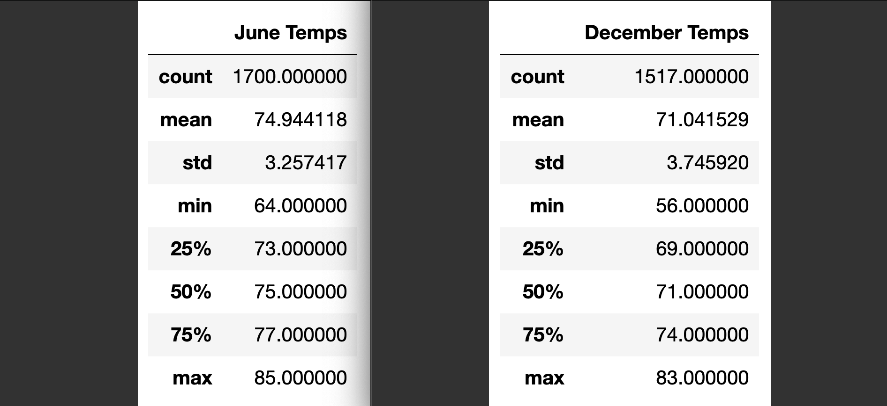
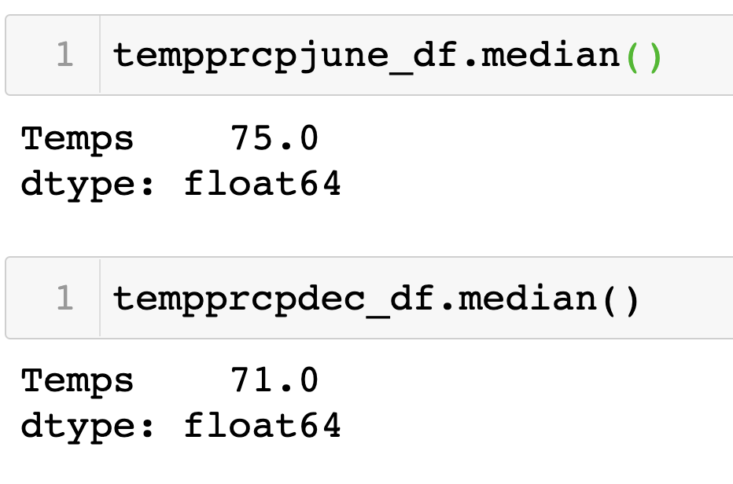
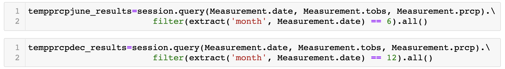
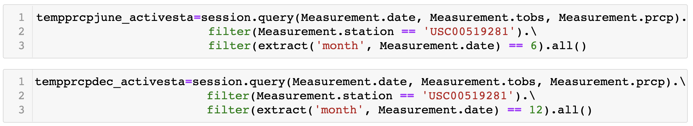
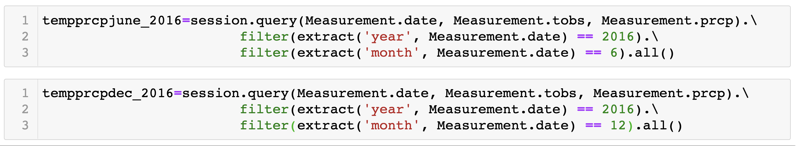

# **Surfs_up - Weather analysis for Surf & Ice-cream shop**
- Analyse the weather data across Oahu - a potential Hawaii Island to invest and setup a Surf & Ice-cream shop.
- Weather data is stored in SQLite Database file which is analysed using SQLAlchemy in Pandas and present the analysis using Flask. 
## Overview of the Project :
- Surfs Up, is about surf & icecream shop business venture in Oahu, an Hawaiian Island
- Based on the weather data collected across Oahu in SQLite database, analysis has to be performed using SQLAlchemy in Pandas to infer the exact location for Surf shop in Oahu so that the business is viable through out the year.
- Based on the weather data analysis, location has to be inferred and presented to venture capitalists using flask application.
- The jupyter notebook script file can be opened using this link : <a href="https://github.com/VinuthaBS/Surfs_up/blob/main/SurfsUp_Challenge.ipynb">------> SurfsUp_Challenge script file</a>
---
# **Surf's up analysis Results**
- </img>
- Weather data was collected across the Oahu island with the help of 9 Weather stations.
- For a time span of around 6 to 7 yrs of weather data was stored in the sqlite DB from the year 2010 to 2017.
- To understand the trends of the weather during the mid of the year and end of the year, statistics were compared for the month of june and december with the data across Oahu. 
- When june and december statistics were compared, the month of june has better temperatures ranging between 64 to 85 ideal for surfing and having icecreams whereas during december temperatures drop around 4 to 6 points and ranges between 56 to 83. 
- Same trend of dropping temperature in december is seen even in mean temp readings. June has a mean temp of 75 but december has around 71.
- The percentile stats also reveals the same trends of proportionate dropping of temps in december when compared to % values of june. 
- The mean value is very close enough to median value calculated for the same dataframe hence we can also infer that weather data seems symmetric.
# **Summary**
- Though there is a temperature drop during december, the readings doesnt show too much of a variation. We can observe that even in december the temp is suitable for a surf or icecream as there are days having temp of 70+ and also sees max temp days of 83 as well.
- As the stats are taken for values collected across the island and through 6yrs of readings, the analysis seems reliable and dependable to take a decision on investing for a surf and icecream shop. 
- Weather data can be analysed further on certain aspects like mean in comparison to median statistic. As the median is not included in the statistics that we have arrived at in the June and Dec analysis, we can calculate the median separately on the dataframe created for june, december to understand if the data is skewed. Query sample provided below.
- </img>
- We can even study further by including precipitation trends as well along with temp readings. This will be a wholistic approach to gauge both temp and likelihood of rain in Oahu during june and december. Query sample provided below to display precipitation data along with temp and filter the data on months.
- </img>
- To further our analysis and pinpoint the exact location in Oahu where the Surf and icecream shop can be setup, we can analyse the data specifically by filtering on the exact station among the 9 available stations of Oahu. For eg, we can analyse june and december data collected specifically for the most active station of Oahu. Query sample provided below with filter for both station and month.
- </img>
- Lastly we can even analyse the data by filtering for specific year and the month as shown below with an eg of year 2016, june and december month.
- </img>
---
---